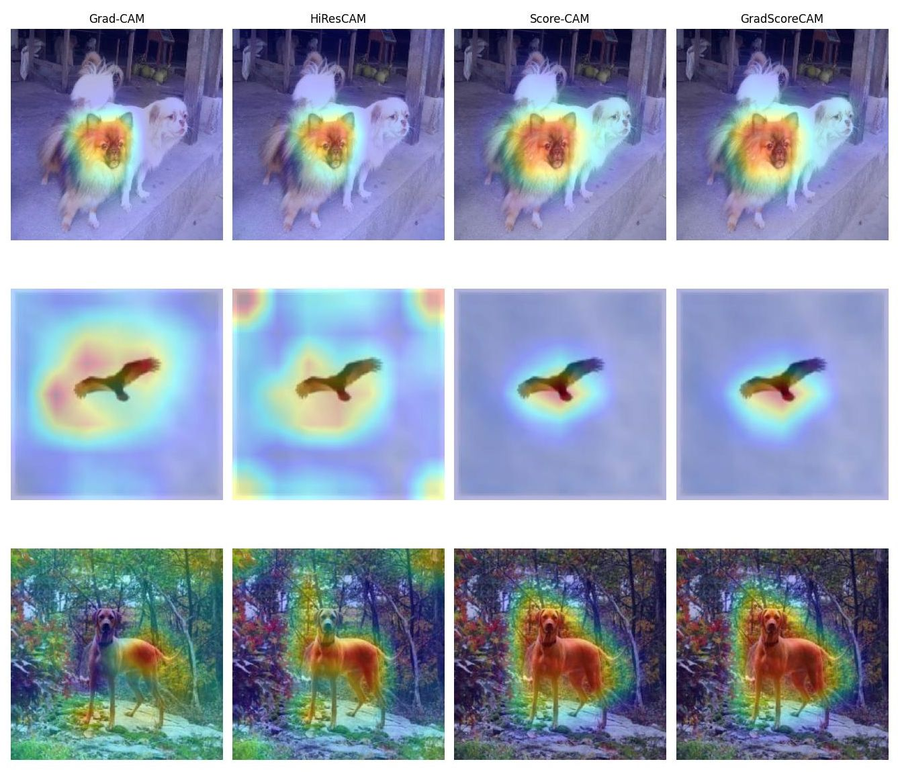

# GradScoreCAM

GradScoreCAM is a hybrid class activation mapping method for explaining predictions made by convolutional neural networks. It combines gradient-based channel selection with Score-CAM-style perturbation weights, preserving most of Score-CAM's localization quality while requiring far fewer forward passes.



## How it works

For a target class, GradScoreCAM:

1. computes an importance score for every activation map using the element-wise product of the activation and its gradient;
2. keeps only the highest-scoring fraction of maps, controlled by `topk_ratio`;
3. upsamples and normalizes the selected maps, then uses them to mask the input image;
4. evaluates the masked images and applies a softmax to obtain perturbation-based weights;
5. produces the final explanation as a weighted sum of the selected activation maps followed by ReLU.

This reduces the main cost of Score-CAM: evaluating a masked input for every channel. With `topk_ratio=1.0`, the method uses all activation maps and approaches the Score-CAM procedure; smaller values trade a limited amount of explanation quality for speed.

## Repository contents

- `method.py` - reusable `GradScoreCAM` implementation based on `pytorch-grad-cam`'s `BaseCAM`.
- `gibrid-metrics.ipynb` - experiment notebook comparing Grad-CAM, HiResCAM, Score-CAM, and GradScoreCAM using insertion AUC, deletion AUC, and GPU runtime.
- `methods.jpg` - qualitative comparison of the four methods.

## Installation

Python 3.9 or newer is recommended. Install the packages used by the implementation and experiment notebook:

```bash
pip install torch torchvision grad-cam numpy pillow matplotlib opencv-python requests tqdm captum
```

A CUDA-capable GPU is optional for generating explanations, but the runtime benchmark in the notebook requires CUDA.

## Quick start

```python
import torch
from PIL import Image
from torchvision import models, transforms
from pytorch_grad_cam.utils.model_targets import ClassifierOutputTarget

from method import GradScoreCAM

device = torch.device("cuda" if torch.cuda.is_available() else "cpu")

model = models.vgg16(
    weights=models.VGG16_Weights.IMAGENET1K_V1
).to(device).eval()

preprocess = transforms.Compose([
    transforms.Resize((224, 224)),
    transforms.ToTensor(),
    transforms.Normalize(
        mean=[0.485, 0.456, 0.406],
        std=[0.229, 0.224, 0.225],
    ),
])

image = Image.open("path/to/image.jpg").convert("RGB")
input_tensor = preprocess(image).unsqueeze(0).to(device)

with torch.no_grad():
    class_id = model(input_tensor).argmax(dim=1).item()

cam = GradScoreCAM(
    model=model,
    target_layers=[model.features[-1]],
    topk_ratio=0.1,
)

grayscale_cam = cam(
    input_tensor=input_tensor,
    targets=[ClassifierOutputTarget(class_id)],
)[0]
```

`grayscale_cam` is a normalized two-dimensional saliency map. It can be resized or overlaid on the original image with the visualization utilities provided by `pytorch-grad-cam`.

## Reproducing the experiments

Open `gibrid-metrics.ipynb` in Jupyter or Kaggle and run its cells in order. Before running it:

1. provide an ImageNet validation set;
2. change `image_directory` in the notebook to the local dataset path;
3. use a CUDA GPU for the timing section.

The notebook evaluates 1,000 randomly sampled validation images with VGG16 and uses 50 perturbation steps for insertion and deletion. Runtime is benchmarked separately on 50 images. The experiment reported in the accompanying work used an NVIDIA T4 GPU and `topk_ratio=0.1`.

## Results

Higher insertion AUC and lower deletion AUC are better. Runtime is the mean time per image reported for the VGG16 experiment.

| Method | Insertion AUC ↑ | Deletion AUC ↓ | Runtime (ms) ↓ |
| --- | ---: | ---: | ---: |
| Grad-CAM | 24.02 | 4.48 | 41.0 ± 0.5 |
| HiResCAM | 23.30 | 4.65 | 41.2 ± 0.5 |
| Score-CAM | **24.62** | **4.32** | 2749.5 ± 59.8 |
| GradScoreCAM | 24.56 | 4.33 | **319.5 ± 4.3** |

In this setup, GradScoreCAM retained results close to Score-CAM while running approximately 8.6 times faster. These values are specific to the stated model, dataset, hardware, target layer, and evaluation procedure.

## Choosing `topk_ratio`

`topk_ratio` is the fraction of activation maps retained after gradient-based ranking:

- lower values reduce the number of model evaluations and improve speed;
- higher values preserve more channels and move the method closer to Score-CAM;
- `0.1` was used for the reported experiment;
- the implementation default is `0.05`.

The best value may vary by architecture and target layer, so it should be validated for the intended use case.

## References

- R. R. Selvaraju et al., “Grad-CAM: Visual Explanations from Deep Networks via Gradient-Based Localization,” ICCV, 2017.
- R. L. Draelos and L. Carin, “Use HiResCAM instead of Grad-CAM for faithful explanations of convolutional neural networks,” arXiv:2011.08891, 2020.
- H. Wang et al., “Score-CAM: Score-Weighted Visual Explanations for Convolutional Neural Networks,” CVPR Workshops, 2020.
- V. Petsiuk, A. Das, and K. Saenko, “RISE: Randomized Input Sampling for Explanation of Black-box Models,” arXiv:1806.07421, 2018.
